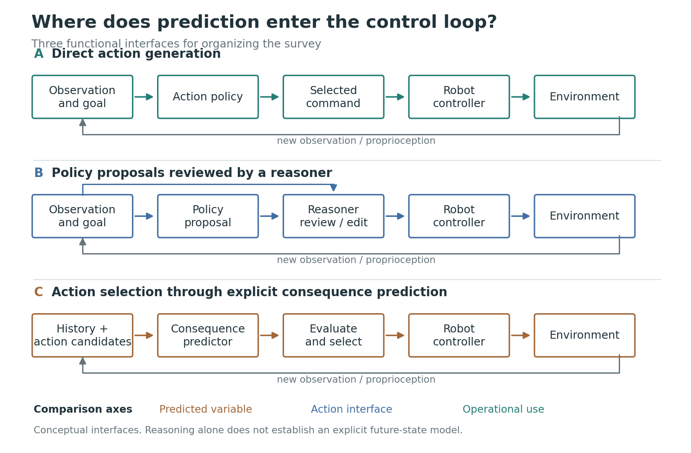

<a id="top"></a>

<div align="center">

# World Models for Physical AI

**面向物理智能的世界模型：概念、模型、策略融合与可靠性**

ACM Computing Surveys 综述工作仓库 · 论文草稿与七类文献索引

<p>
  <a href="paper/preview/main.pdf"></a>
  <a href="paper/main.tex"></a>
  <a href="#literature"></a>
  <a href="literature/catalog.csv"></a>
  <a href="literature/PUBLICATION_FAMILIES.md"></a>
</p>

<p>
  <a href="paper/preview/main.pdf"><b>论文 PDF</b></a> ·
  <a href="#literature"><b>文献导航</b></a> ·
  <a href="RELATED_SURVEYS.md"><b>同类调研</b></a> ·
  <a href="literature/SEARCH_PROTOCOL.md"><b>检索协议</b></a> ·
  <a href="literature/SEARCH_LOG.md"><b>检索日志</b></a> ·
  <a href="literature/CLAIM_TRACE.md"><b>主张溯源</b></a> ·
  <a href="literature/PUBLICATION_FAMILIES.md"><b>论文族清洗</b></a> ·
  <a href="paper/references.bib"><b>BibTeX</b></a> ·
  <a href="literature/WRITING_GAPS.md"><b>待补方向</b></a> ·
  <a href="#contributing"><b>参与整理</b></a>
</p>

</div>

---

> **当前版本：v0.2 第一轮内容稿。** 四部分正文、2 图、8 表、103 条参考文献，尚非投稿定稿。文献目录的 **929 条为分类记录**；剔除 15 条非论文占位项并进行可复算去重后得到 758 个暂定论文族，仍不是完整系统综述的最终唯一论文数。详见[写作进度与证据说明](WRITING_STATUS.md)。

<a id="overview"></a>

## 研究概览

围绕“预测如何服务于物理交互与决策”组织综述，连接数据与表示、预测模型、机器人策略，以及评估和安全。四部分构成正文主线，七类文献目录承担检索与协作，两者不要求一一对应。

<p align="center">
  <a href="paper/figures/fig01_prediction_policy_interfaces.png">
    
  </a>
</p>

<p align="center"><sub>图 1 · 预测与控制接口。概念示意，不表示实验性能或模型排名。<a href="paper/figures/fig01_prediction_policy_interfaces.pdf">矢量 PDF</a> · <a href="paper/build_figure.py">绘图源码</a></sub></p>

<a id="outline"></a>

## 四部分正文

| 部分 | 核心内容 | 正文入口 |
|:---|:---|:---|
| I · 概念基础与研究范围 | 定义与纳入边界、发展脉络、已有综述与本文定位 | [Foundations and Scope](paper/sections/01_foundations.tex) |
| II · 数据、表示与模型 | 动作数据、视觉预测、潜在表示、结构化物理、跨场景与跨本体泛化 | [Data, Representations, and Predictive Models](paper/sections/02_data_models.tex) |
| III · 与机器人策略的融合 | 模型式规划、想象学习、视觉计划、联合世界与动作模型、Astra 专题 | [Integration with Robot Policies](paper/sections/03_policy_integration.tex) |
| IV · 评估、可靠性与前沿 | 预测质量与决策收益、不确定性、安全约束、恢复机制和研究方向 | [Evaluation, Reliability, and Research Directions](paper/sections/04_evaluation.tex) |

<a id="literature"></a>

## 七类文献导航

按研究主题进入分类页，或下载 [CSV 总表](literature/catalog.csv) 按年份、作者与来源筛选。[检索、筛选与证据协议](literature/SEARCH_PROTOCOL.md) · [检索与发现日志](literature/SEARCH_LOG.md) · [主张溯源索引](literature/CLAIM_TRACE.md) · [暂定论文族与清洗决策](literature/PUBLICATION_FAMILIES.md) · [论文族 CSV](literature/publication_families.csv) · [完整目录与统计口径](literature/README.md) · [首轮外部库去重候选](literature/EXTERNAL_CANDIDATES.md) · [第二轮增量候选](literature/EXTERNAL_CANDIDATES_DELTA_2026-10-02.md) · [首批原文核验](literature/EVIDENCE_BATCH_01.md) · [接触与结构化物理核验](literature/EVIDENCE_BATCH_04_CONTACT_STRUCTURED.md) · [导航与驾驶核验](literature/EVIDENCE_BATCH_05_NAVIGATION_DRIVING.md) · [闭环导航核验](literature/EVIDENCE_BATCH_06_NAVIGATION_CLOSED_LOOP.md) · [记忆与恢复核验](literature/EVIDENCE_BATCH_07_MEMORY_RECOVERY.md) · [风险校准与干预代价核验](literature/EVIDENCE_BATCH_08_CALIBRATION_INTERVENTION.md) · [实体在线学习与虚拟纠正核验](literature/EVIDENCE_BATCH_09_INTERACTIVE_IMPROVEMENT.md) · [失败后恢复与任务续接核验](literature/EVIDENCE_BATCH_10_RECOVERY_RESUMPTION.md) · [CVPR 2026 策略融合核验](literature/EVIDENCE_BATCH_11_CVPR2026_POLICY_INTEGRATION.md) · [CVPR 2026 物理表示核验](literature/EVIDENCE_BATCH_12_CVPR2026_PHYSICAL_REPRESENTATIONS.md) · [几何驾驶与触觉 WAM 核验](literature/EVIDENCE_BATCH_13_GEOMETRY_TACTILE_WAM.md) · [预测接口与后训练核验](literature/EVIDENCE_BATCH_14_PREDICTIVE_INTERFACES.md) · [生成调度与事件级执行核验](literature/EVIDENCE_BATCH_15_GENERATION_SCHEDULES_EVENTS.md) · [诊断评估与预测完整性核验](literature/EVIDENCE_BATCH_16_DIAGNOSTIC_EVALUATION.md) · 快照日期：2026-10-02。

| 分类 | 检索方向 | 分类记录 |
|:---|:---|---:|
| [01 · 世界模型基础与控制](literature/categories/01-foundations-control.md) | 学习动力学、模型式强化学习、模型预测控制 | 96 |
| [02 · 视觉与视频世界模型](literature/categories/02-visual-video.md) | 动作条件视频预测、交互模拟、长时滚动 | 61 |
| [03 · Latent 与预测表示](literature/categories/03-latent-representations.md) | 潜在动力学、预测表征、表征与控制的连接 | 75 |
| [04 · 结构化物理与多模态](literature/categories/04-physics-multimodal.md) | 三维结构、接触与形变、触觉和力觉 | 54 |
| [05 · 数据、模拟与跨本体](literature/categories/05-data-simulation-embodiment.md) | 机器人数据、模拟数据、人类视频、跨本体对齐 | 192 |
| [06 · 世界模型、VLA 与规划](literature/categories/06-policy-planning.md) | 预测与策略耦合、动作生成、规划与重规划 | 199 |
| [07 · 评估、安全与 Benchmark](literature/categories/07-evaluation-safety.md) | 闭环评估、风险与校准、约束与恢复机制 | 252 |

目录是候选文献索引，不等于正文引用清单。32 条记录暂缺可导出的公开链接；本轮另列的补充来源不计入上述快照。发表状态、版本与实验结论仍需回到原始来源核对。

<a id="updates"></a>

## 进展与下一步

| 日期 | 更新 |
|:---|:---|
| 2026-10-02 | 核验 6 篇评估与可靠性工作，补入实体 benchmark、stage-wise 退化诊断、几何候选筛选、预测完整性攻击和驾驶全谱评价。 |
| 2026-10-02 | 全文核验 DriveWAM、NoiseGate、DAWN、WALL-WM 与 ADriver-I，区分先未来后动作、latent 调度、递归交互、事件级执行和模型内递归驾驶。 |
| 2026-10-02 | 新增检查三个自动驾驶 world-model 开源调研源；仍只用于发现和交叉补漏，不直接支撑论文结论。 |
| 2026-10-02 | 增量核查开源同类调研，登记两个 WAM 论文配套库和一个模拟器--世界模型综述库，保持发现源与论文证据分离。 |
| 2026-10-02 | 完成 CVPR 2026 R19 候选的第二批全文核验，补入 DWM、PhyWM、PhysInOne 与 GeoWorld，并将 ModularAgent 保留为仿真边界案例。 |
| 2026-10-02 | 汇总 R00--R13 检索与语料操作日志；保留已记录精确查询，对未保存的查询与结果数明确标注 NR。 |
| 2026-10-02 | 建立可复算 publication-family 层：929 条源记录中排除 15 条非论文占位项，将 914 条论文候选解析为 758 个暂定论文族，并记录错链修正与人工合并。 |
| 2026-10-02 | 固化检索、去重、纳入排除和证据追踪协议，明确当前保证为 bounded claims 而非完整系统综述。 |
| 2026-10-02 | 核验 Dream2Fix、REBOOT、VLA-FixBench 与 AgentChord，区分世界模型恢复数据、人工恢复示范、诊断回滚和实体任务续接。 |
| 2026-10-02 | 定向检查 ICML 2026 正式论文，补入 VLAW 与 Task-Sufficient World Models，并将 Latent Reasoning VLA 核定为预测辅助策略的边界对照。 |
| 2026-10-02 | 更新 GitHub 同类调研扫描，新增 4 个发现源并保持冻结候选计数不变，等待下一轮统一去重。 |
| 2026-10-02 | 定向检查 CVPR 2026 官方论文，补入 Motus、DynBridge 与 MM-ACT，区分联合生成、预测辅助监督和可查询前向模型。 |
| 2026-10-02 | 核验 WorldSample、VLAW、Hi-WM、WorldSync 与 FoMo-FD，区分真实在线 RL、模型--策略共进化、模型内人工纠正、动作跟随和离线失败检测。 |
| 2026-10-02 | 核验 Foresight、KnowNo、CoFineLLM 与 ThriftyDAgger，区分失败检测、校准求助、在线干预及其人工代价。 |
| 2026-10-02 | 区分长期记忆、失败前风险预测、失败后纠正与状态恢复，核验 Mem-World、WorldScape Policy 2.0、FARL、ViFailback 和 LIBERO-Recover。 |
| 2026-10-02 | 核验 NWM、DreamerNav、NavThinker 与 NavWAM，补入闭环层级、实体分母和预测是否直接参与动作选择的边界。 |
| 2026-10-02 | 核验 5 篇导航与驾驶工作，区分推理时 rollout、联合场景--轨迹预测和训练时预测监督，并修正两项目录元数据。 |
| 2026-10-02 | 核验 5 篇接触、触觉与结构化三维工作，补入多材料 MPC、多视角动作反演、条件性触觉增益和人类触觉数据迁移。 |
| 2026-10-02 | 补入实体运行时监测、语义计划护栏和可验证安全模块，并记录 2026 风险知情世界模型议程。 |
| 2026-10-02 | 核验 5 篇安全原始来源，区分条件性保证、仿真降风险和未验证的运行时护栏架构。 |
| 2026-10-02 | 原文核验 5 篇最高优先级候选，补入接触、4D、交互模拟、隐式规划和模型--策略共进化证据。 |
| 2026-10-02 | 重整仓库首页，提供图示、四部分正文入口与七类文献导航。 |
| 2026-10-02 | 新增[同类开源调研与差异化定位](RELATED_SURVEYS.md)，并补入高度重合的 Physical AI 已发表综述。 |
| 2026-10-01 | v0.2 第一轮内容稿：四部分正文、1 图、7 表、31 条参考文献；同步 929 条分类记录。 |

下一轮优先补充下列内容，具体文献、检索词和核对状态见[边写边补清单](literature/WRITING_GAPS.md)：

- [ ] 长时组合接触、跨触觉硬件迁移与力觉校准的模型级原始论文。
- [ ] 导航与驾驶的跨平台实体复现，以及预测预训练与推理时预测的统一实体消融。
- [ ] 把校准报警接入真实机器人在线干预，并补跨操作者/平台分布偏移、事故严重度和开放故障下的状态恢复。
- [ ] 人类视频、失败与恢复数据、跨本体动作对齐。
- [ ] 正式出版版本、检索筛选记录与全文证据位置的统一核查。

<a id="contributing"></a>

## 参与整理

通过 [Issue](https://github.com/Dracoxa/World-Models-for-Physical-Survey/issues) 提交补充或纠错，或通过 [Pull Request](https://github.com/Dracoxa/World-Models-for-Physical-Survey/pulls) 修改文献与正文。建议同时提供：

1. **可定位的论文**：完整题名、作者、年份、DOI 或 arXiv 链接；注明预印本或正式发表版本。
2. **分类与用途**：对应七类中的哪一类，以及能够支撑综述中的哪项讨论。
3. **可核查的证据**：原文章节、图表或页码；区分实验观察、作者结论与综述判断。

更正现有记录时请附目录编号。跨主题归类不视为新增独立论文，项目报告与扩展稿中的重合实验也不作为独立重复验证。

<a id="development"></a>

## 编译与维护

<details>
<summary><b>ACM Computing Surveys 模板与论文编译</b></summary>

主文件：[paper/main.tex](paper/main.tex)；参考文献：[paper/references.bib](paper/references.bib)。

稿件使用官方 `acmart` 文档类、`\acmJournal{CSUR}` 和 `ACM-Reference-Format` 参考文献样式。当前采用 `manuscript,review,anonymous` 单栏带行号的工作稿配置，延续项目原始材料；匿名选项是此稿的工作设置，不表示已确认期刊的匿名要求。

最终投稿前应依据 [CSUR 作者指南](https://dl.acm.org/journal/csur/author-guidelines)核对当期规定，补齐作者、机构和元数据。当前没有编造 DOI、卷期或录用日期。CSUR 的期刊排版预览可将文档类选项改为 `acmsmall`；审稿稿件的具体设置仍以编辑部要求为准。

安装包含 `acmart` 的 TeX Live / MacTeX 后，在 `paper/` 中运行：

```sh
latexmk -pdf -no-shell-escape -interaction=nonstopmode -halt-on-error -outdir=build main.tex
```

`paper/preview/main.pdf` 是已编译的审阅快照。修改正文后需要重新编译并更新此快照。

</details>

<details>
<summary><b>从协作表更新文献目录</b></summary>

在仓库根目录运行：

```sh
python literature/export_catalog.py path/to/workbook.xlsx
```

导出依赖 `openpyxl`。分类记录保留跨主题重复，尚未完成逐篇真实性和结论核查；公开目录提供题名与来源检索，正文仅使用已核对的相关出处。

</details>

<details>
<summary><b>图表源文件</b></summary>

`paper/build_figure.py` 使用 Matplotlib 生成 PDF、SVG 和 PNG。矢量文件用于论文，PNG 用于预览。图 1 比较控制接口，图 2 连接模型设计、系统用途和可支持论断；两图均不表示实验性能或模型排名。

</details>

---

首页编排参考 [NanoResearch](https://github.com/OpenRaiser/NanoResearch)，研究内容与文献目录独立整理。

<p align="right"><a href="#top">返回顶部</a></p>
